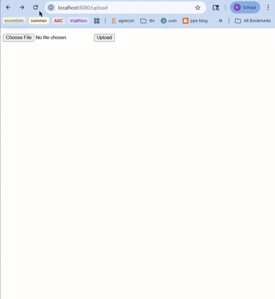

# Flask on Docker


## Summary

This project shows how to containerize a Flask web application with PostgreSQL, Gunicorn, and Nginx using Docker and Docker Compose. The development environment runs Flask's built-in server with a PostgreSQL database, while the production environment adds Gunicorn as a WSGI server and Nginx as a reverse proxy to handle client requests and serve static and media files. The app exposes a simple REST API, supports user uploads via a web form, and stores data in a persistent PostgreSQL volume — making it a solid foundation for any production-ready Flask application.

## Demo



## Build Instructions

### Dependencies

- [Docker](https://docs.docker.com/get-docker/)
- [Docker Compose](https://docs.docker.com/compose/install/)

### Development

**1. Clone the repo:**
```bash
git clone https://github.com/khodge1607/flask-on-docker.git
cd flask-on-docker
```

**2. Create a `.env.dev` file in the project root:**
```bash
FLASK_APP=project/__init__.py
FLASK_DEBUG=1
DATABASE_URL=postgresql://hello_flask:hello_flask@db:5432/hello_flask_dev
SQL_HOST=db
SQL_PORT=5432
DATABASE=postgres
APP_FOLDER=/usr/src/app
```

**3. Build and start the containers:**
```bash
docker compose up -d --build
```

**4. Create the database tables:**
```bash
docker compose exec web python manage.py create_db
```

**5. (Optional) Seed the database with sample data:**
```bash
docker compose exec web python manage.py seed_db
```

**6. Navigate to** `http://localhost:8080/` — you should see:
```json
{ "hello": "world" }
```

**7. To bring the containers down:**
```bash
docker compose down -v
```

---

### Production

**1. Create `.env.prod` and `.env.prod.db` files in the project root. These files are not included in the repo as they contain sensitive information.**

`.env.prod`:
```bash
FLASK_APP=project/__init__.py
FLASK_DEBUG=0
DATABASE_URL=postgresql://hello_flask:hello_flask@db:5432/hello_flask_prod
SQL_HOST=db
SQL_PORT=5432
DATABASE=postgres
APP_FOLDER=/home/app/web
```

`.env.prod.db`:
```bash
POSTGRES_USER=hello_flask
POSTGRES_PASSWORD=hello_flask
POSTGRES_DB=hello_flask_prod
```

**2. Build and start the production containers:**
```bash
docker compose -f docker-compose.prod.yml up -d --build
```

**3. Create the database tables:**
```bash
docker compose -f docker-compose.prod.yml exec web python manage.py create_db
```

**4. Navigate to** `http://localhost:8080/`

**5. To upload a file**, navigate to `http://localhost:8080/upload`, select a file, and click Upload. View it at `http://localhost:8080/media/<filename>`.
